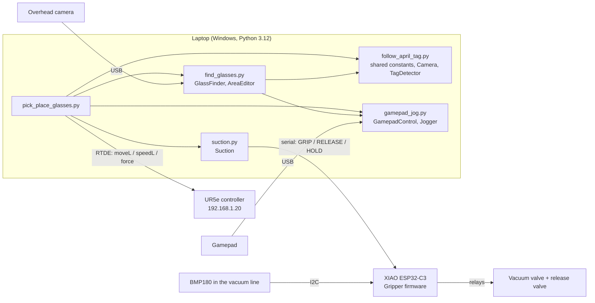

# Hacklab Alien Bazaar 2026: team Rabyte

Code for team **Rabyte** at the [Alien Bazaar 2026](https://hacklab.so/hackathons/ab26) hardware hackathon (Warsaw, 25–27 Sep 2026, theme: home automation). Our pitch is "the ultimate party bot", built on a **Universal Robots UR5e** with a custom **vacuum (suction) gripper**.

The current demo: an **overhead camera finds glasses** on the table, the robot **picks one up with the suction cup** and **puts it down on an AprilTag**. Other parts of the repo are side experiments: a wrist-camera AprilTag picker, a hoverboard drive base and bus-servo accessories (a rotator and a pump sprayer).

Background on the event, rules and other teams: [alien-bazaar-2026-brief (1).md](<alien-bazaar-2026-brief (1).md>).
Known bugs and suggested improvements: [AUDIT.md](AUDIT.md).

---

## Contents

1. [Hardware](#1-hardware)
2. [System overview](#2-system-overview)
3. [Repository layout](#3-repository-layout)
4. [Setup](#4-setup)
5. [Coordinate frames and calibration files](#5-coordinate-frames-and-calibration-files)
6. [Calibration workflow (do this in order)](#6-calibration-workflow-do-this-in-order)
7. [Running the demos](#7-running-the-demos)
8. [Gamepad and keyboard controls](#8-gamepad-and-keyboard-controls)
9. [How the glass pipeline works](#9-how-the-glass-pipeline-works)
10. [Suction gripper](#10-suction-gripper)
11. [Bus servos (rotator and sprayer)](#11-bus-servos-rotator-and-sprayer)
12. [Hoverboard experiments](#12-hoverboard-experiments)
13. [Safety limits](#13-safety-limits)
14. [Where to change settings](#14-where-to-change-settings)
15. [Troubleshooting](#15-troubleshooting)

---

## 1. Hardware

| Part | What it is | How it connects to the PC |
|---|---|---|
| **UR5e** robot arm | 6-DOF cobot with a built-in force/torque sensor at the flange | Ethernet, RTDE through [`ur_rtde`](https://sdurobotics.gitlab.io/ur_rtde/). Static IP `192.168.1.20` |
| **Suction gripper** | A suction cup on the flange. Vacuum and release are switched by two relays. A BMP180 barometer in the vacuum line senses whether an object is held | Seeed **XIAO ESP32-C3** running [`Gripper/`](Gripper/), USB serial `COM9`, 115200 baud |
| **Wrist camera** | USB webcam on the tool, 1280×720 | USB, OpenCV camera index `0` |
| **Overhead camera** | USB webcam about 1.06 m above the table, looking straight down (4° tilt) | USB, OpenCV camera index `2` |
| **Gamepad** | Xbox-style controller | USB/Bluetooth, read through `pygamepad` / `inputs` |
| **Bus servos** (experimental) | Waveshare ST3215 servos on a Seeed Bus Servo Driver Board | USB serial `COM10`, 1 Mbaud |
| **Hoverboard** (experimental) | Hoverboard mainboard with bipropellant firmware | USB-UART `COM6` directly, or through a XIAO bridge on `COM8` |

> COM ports and camera indices are what they were on Andrzej's laptop. They **will** differ on other machines and can change after re-plugging. See [§14](#14-where-to-change-settings).

---

## 2. System overview



All motion runs on the laptop. The robot runs the `ur_rtde` control script, which the Python side uploads over RTDE. **Do not run a PolyScope program at the same time.** The gripper is a separate USB device with its own small state machine.

---

## 3. Repository layout

```
alien_bazaar_2026/
├── README.md                          ← this file
├── CLAUDE.md                          ← guidance for AI coding assistants
├── AUDIT.md                           ← code audit + improvement roadmap
├── alien-bazaar-2026-brief (1).md     ← hackathon brief (rules, hardware, teams)
│
├── ur5e_experiments/                  ← everything that runs the robot
│   ├── pick_place_glasses.py          ★ main demo: overhead camera → pick glass → place on tag
│   ├── find_glasses.py                ★ glass detection + overhead-camera calibration (library + tool)
│   ├── follow_april_tag.py            wrist-camera AprilTag picker; also the shared-constants hub
│   ├── hand_eye_calibration.py        automatic wrist camera ↔ TCP calibration
│   ├── calibrate_camera.py            lens calibration with a ChArUco board (either camera)
│   ├── gamepad_jog.py                 gamepad → speedL jogging helper (used by the others)
│   ├── robot_watchdog.py              RTDE watchdog: robot stops if the main loop stalls
│   ├── suction.py                     host driver for the gripper serial protocol
│   ├── bus_servos.py                  Feetech/Waveshare STS bus servos: rotator + sprayer
│   ├── gamepad_robot_teleop.py        plain gamepad teleop with auto fault recovery
│   ├── gamepad_robot_move.py          early experiment (blocking moveL), legacy
│   ├── move_robot.py                  first RTDE hello-world (URSim at 127.0.0.1), legacy
│   ├── charuco_board.png              printable calibration board
│   ├── camera_calibration.npz         wrist camera intrinsics          (generated)
│   ├── hand_eye.npz                   wrist camera pose in tool frame  (generated)
│   ├── overhead_camera_calibration.npz  overhead intrinsics            (generated)
│   ├── overhead_camera_pose.npz       overhead camera pose in base frame (generated)
│   ├── overhead_calibration_points.json  touched calibration points, resumable (generated)
│   ├── detection_area.json            table polygon where glasses count (generated, editable)
│   ├── detection_settings.json        detection trackbar values (generated)
│   └── README.md                      URSim notes
│
├── Gripper/                           ← PlatformIO firmware for the XIAO ESP32-C3 suction controller
│   ├── src/main.cpp
│   ├── platformio.ini
│   └── README.md                      wiring + full serial protocol
│
└── hoverboard_experiments/            ← driving a hoverboard base from a gamepad
    ├── bipropellant_serial.py         minimal bipropellant binary protocol client
    ├── gamepad_hoverboard_teleop.py   gamepad → PC → hoverboard (binary protocol)
    ├── gamepad_xiao_teleop.py         gamepad → PC → XIAO (ASCII) → hoverboard
    └── xiao_send_pwm/xiao_send_pwm.ino  XIAO sketch: ASCII "a<speed> b<steer>" → HoverboardAPI
```

Every Python script starts with a long docstring that explains how it works, the keys and the setup steps. **That docstring is the most detailed documentation of each script**; this README summarises and connects them.

---

## 4. Setup

### 4.1 Python environment

Tested with **Python 3.12** on Windows 11. The venv lives in `ur5e_experiments/.venv` (VS Code picks it up through `.vscode/settings.json`).

```powershell
cd ur5e_experiments
py -3.12 -m venv .venv
.venv\Scripts\Activate.ps1
pip install ur_rtde==1.6.5 opencv-python==5.0.0.93 numpy pyserial cobs inputs pygamepad
```

| Package | Version in the venv | Used for |
|---|---|---|
| `ur_rtde` | 1.6.5 | RTDE control/receive of the UR5e |
| `opencv-python` | 5.0.0.93 | cameras, AprilTag/ArUco/ChArUco, HoughCircles, solvePnP |
| `numpy` | 2.5.3 | everything |
| `pyserial` | 3.5 | gripper, bus servos, hoverboard |
| `cobs` | 1.2.2 | bipropellant protocol (COBS/R framing) |
| `inputs` | 0.5 | gamepad detection |
| `pygamepad` | 0.2 | gamepad state |

The code relies on OpenCV 5 behaviour in a few places. For example, `calibrate_camera.py` reshapes the ChArUco corners and `hand_eye_calibration.py` falls back to its own Park–Martin solver when `cv2.calibrateHandEye` is missing.

### 4.2 Robot

1. Connect the laptop by Ethernet to the UR5e controller. The robot is at `192.168.1.20`; give the laptop a static address in the same subnet.
2. On the teach pendant: **Remote Control** enabled, or at least RTDE reachable, with no PolyScope program running.
3. **Set the TCP to the tip of the suction cup.** All the code assumes `getActualTCPPose()` is the point that touches the object. Every calibration (hand-eye, overhead pose) is relative to this TCP. **If you change the TCP, redo the calibrations.**
4. Set the payload to match the gripper, so that the force readings are sensible.

### 4.3 Simulator (no robot needed)

URSim runs in Docker through WSL (see [ur5e_experiments/README.md](ur5e_experiments/README.md)):

```powershell
wsl -- sudo docker run --rm -it --name ursim -p 5900:5900 -p 6080:6080 -p 29999:29999 -p 30001-30004:30001-30004 universalrobots/ursim_e-series
```

Pendant in the browser: http://localhost:6080/vnc.html. Point the scripts at `127.0.0.1` (change `IP`, see [§14](#14-where-to-change-settings)). The simulated robot has no real force sensor, so force-based contact detection falls back to the max-depth limits.

### 4.4 Gripper firmware

Open `Gripper/` in VS Code with the PlatformIO extension, then **Build** and **Upload**. Or run `pio run -t upload` in `Gripper/`. Details are in [Gripper/README.md](Gripper/README.md).

---

## 5. Coordinate frames and calibration files

All positions are in **metres**, angles in **radians**. The exceptions are constants whose names end in `_DEG`. UR poses are `[x, y, z, rx, ry, rz]`, where `r*` is an **axis-angle** (rotation vector), not RPY. `pose_to_matrix()` in `follow_april_tag.py` turns a pose into a 4×4 matrix.

| Frame | Meaning |
|---|---|
| **base** | UR5e base frame. The work table is in front of the robot, at roughly `y ∈ [-1.05, -0.0]`, `x ∈ [-0.35, 0.35]` m, with the table surface at `z ≈ 0.006` m |
| **tcp** | Tip of the suction cup (set on the pendant). The tool Z axis points out of the cup; "tool pointing down" means tool Z = −base Z |
| **cam** (wrist) | OpenCV camera frame of the wrist webcam: X right, Y down, Z forward |
| **cam** (overhead) | OpenCV camera frame of the overhead webcam |
| **tag** | AprilTag frame: origin at the centre, Z out of the printed face |

Chains used in the code:

- Wrist camera: `T_base_tag = T_base_tcp · T_tcp_cam · T_cam_tag`. `T_tcp_cam` comes from `hand_eye.npz`.
- Overhead camera: a pixel is back-projected with `K` and `T_base_cam` and intersected with the plane `z = table_z + height` (`pixel_to_plane()`).

| File | Content | Made by | Used by |
|---|---|---|---|
| `camera_calibration.npz` | `camera_matrix`, `dist_coeffs`, `image_size` of the **wrist** camera | `calibrate_camera.py` | `follow_april_tag.py`, `hand_eye_calibration.py` |
| `hand_eye.npz` | `T_tcp_cam` (4×4). Currently the camera is ≈ 96 / 59 / −73 mm from the tip, rotated ≈ 136° about tool Z | `hand_eye_calibration.py` | `follow_april_tag.py` (otherwise falls back to `CAMERA_OFFSET`/`CAMERA_YAW_DEG`) |
| `overhead_camera_calibration.npz` | intrinsics of the **overhead** camera | `calibrate_camera.py --camera 2 --output …` | `find_glasses.py`, `pick_place_glasses.py` |
| `overhead_camera_pose.npz` | `T_base_cam`, `table_z`, `image_size`, the points used | `find_glasses.py --calibrate` | `find_glasses.py`, `pick_place_glasses.py` |
| `overhead_calibration_points.json` | pixel ↔ base point pairs, plus tags still to touch. Plain JSON, resumable | `find_glasses.py --calibrate` | the same, on restart |
| `detection_area.json` | polygon in **base x, y** where glasses are accepted. It survives camera recalibration | the mouse / the `t` key in `find_glasses.py` or `pick_place_glasses.py` | `GlassFinder` |
| `detection_settings.json` | trackbar values: edge, roundness %, max saturation, min brightness | trackbars (saved automatically) | `GlassFinder` |

All calibrations are **only valid at 1280×720**. `find_glasses.py` refuses a pose file recorded at a different resolution, and the intrinsics are rescaled with a warning.

---

## 6. Calibration workflow (do this in order)

Run everything from `ur5e_experiments/` with the venv active.

### Step 1: Lens calibration (each camera, once per camera + resolution)

```powershell
python calibrate_camera.py --print        # optional: writes charuco_board.png (7x5, 25 mm squares) – print at 100 %
python calibrate_camera.py                # wrist camera (index 0) -> camera_calibration.npz
python calibrate_camera.py --camera 2 --output overhead_camera_calibration.npz   # overhead camera
```

Take about 20 views with SPACE: near and far, tilted 30–45°, covering the image corners. Then press `c`. The coverage overlay shows which parts of the image are already covered. A reprojection error **< 0.5 px is good**; above 1 px, retake the views. If the printed board is not exactly 25 mm per square, pass `--square` or `--scale-bar` (measured with a ruler).

### Step 2: Hand-eye calibration (wrist camera only, after any change to the camera mount or the TCP)

```powershell
python hand_eye_calibration.py
```

Lay a tag (`TAG_SIZE` = 80 mm, 36h11) flat on the table and jog the robot so the tag is centred in the image, 20–35 cm below, tool pointing down. Press SPACE. **The robot moves on its own** through 17 poses (up to ±12° tilt, a few cm of shift). The script solves `AX = XB` with Park–Martin (plus the OpenCV methods if available), keeps the solution with the smallest **tag-position spread**, and writes `hand_eye.npz`. A spread under 5 mm is fine.

### Step 3: Overhead camera pose (after moving the overhead camera or the robot)

```powershell
python find_glasses.py --calibrate          # resumes automatically
python find_glasses.py --calibrate --fresh  # start over (old progress kept as .bak)
```

1. Place 1–8 AprilTags (36h11, any size) across the work area. Raise some on blocks of different heights. Move the robot out of view.
2. **SPACE / A**: the tag centres are measured (median of 20 frames).
3. For each highlighted tag, jog the suction tip onto its centre (gamepad, **LB** for fine moves) or use freedrive (**f / B**), then press **SPACE / A**. **n / X** skips a tag.
4. Repeat with the tags moved until you have **≥ 6 points (10–15 is better)**. Then press **c / Y**: `solvePnP` (SQPNP + LM refinement) prints the error per point. **Aim for < 2–3 mm.**

The lowest touched point becomes `table_z`. Progress is saved after every step, so a crash or a robot restart loses nothing. The current calibration uses 7 points.

### Step 4: Detection area and tuning

```powershell
python find_glasses.py --robot
```

- Drag on empty space to draw a rectangle. Drag a corner to move it, click an edge to add a corner, right-click a corner to delete it. **t / B** adds the current tip x, y as a corner. **u** undoes, **x** clears.
- Tune the trackbars until only glasses are green. Rejected circles are drawn in red with the reason (`colour S…` / `dark V…`).
- **p / X** prints the measured glass positions. **m / Y** moves the tip 5 cm above the glass nearest the image centre, **to check the calibration visually**.

---

## 7. Running the demos

All robot scripts connect to `IP = "192.168.1.20"`. **Keep a hand near the e-stop.**

### 7.1 `pick_place_glasses.py`: main demo

```powershell
python pick_place_glasses.py
```

Needs: the overhead calibration (steps 1, 3 and 4), the suction gripper on `COM9` (optional, see below), an AprilTag lying flat in view as the **place target**, and **upside-down** glasses in the detection area.

Press **p / Y** to run one full cycle:

1. Measure the glasses (median over 15 frames) and the place tag. The last seen tag position is kept, because the placed glass covers the tag.
2. Choose the free glass **closest to the tag** (glasses within 4 cm of the tag count as already placed).
3. Go up to the carry height, over the glass, then down to 2 cm above the foot. Turn the vacuum on and descend at 15 mm/s until the force is **> 10 N** (or 15 mm past the expected height). Wait for `GRIP OK` (at most 6 s; otherwise release and back off).
4. Lift, carry over the tag (watching for `GRIP LOST`), lower, descend until **> 8 N**, release and wait 1.7 s.
5. Go back up and return to the start pose, out of the camera's view.

The tool keeps the orientation it had at the start, which **must be within 10° of pointing down**. Press **h / Start** (home) first if needed. Touching any stick during a task **aborts it** (manual override).

Without the gripper connected, the script prints a warning and uses `NoSuction`. The motion runs and "grip" is assumed successful. This is handy for dry runs.

### 7.2 `find_glasses.py`: detection only / calibration

```powershell
python find_glasses.py            # camera only, no robot
python find_glasses.py --robot    # + jogging, tip marker on the map, 'm' check move, 't' area corners
```

It can also be used as a library:

```python
from find_glasses import GlassFinder, open_camera
cap, w, h = open_camera()
finder = GlassFinder.load(w, h)
for g in finder.measure(cap):          # Glass(x, y, z, diameter, pixel, saturation, brightness)
    print(g.x, g.y, g.diameter)
```

### 7.3 `follow_april_tag.py`: wrist-camera tag picker

```powershell
python follow_april_tag.py
```

Press **p / Y** to pick the tag closest to the image centre, or `TARGET_TAG_ID`. The robot **visually servos** with `speedL`, recomputed every frame:

- **hover**: the camera 25 cm in front of the tag along its normal, tool Z rotated (as little as possible) to point into the tag.
- **approach**: the cup 5 cm in front of the tag.
- **zero_ft → descend**: the vacuum turns on, then the robot pushes along the normal at 20 mm/s until the force is **> 12 N** or it is 2 cm past the surface.
- **dwell**: wait for `GRIP OK`.
- **lift**: back off 15 cm along the normal.

Tags lying flat, tilted or on vertical faces all work, up to `MAX_TILT_DEG = 100°` from vertical. Normals within 8° of vertical snap to vertical. If the camera stops delivering frames for 0.5 s, the robot stops. Jogging is slowed near the `MAX_TCP_Z` ceiling and the `MIN_TCP_Z` table guard (in every script, see §13).

**Sanity check**: with a tag lying still, jog the robot around. The "base" coordinates shown on the tag should barely change. If they drift, redo the hand-eye calibration.

### 7.4 Other scripts

| Script | Command | Notes |
|---|---|---|
| `suction.py` | `python suction.py` | Self-test: status, pressure, grip-and-wait, hold, release |
| `bus_servos.py` | `python bus_servos.py --port COM10 scan` / `demo` / … | See [§11](#11-bus-servos-rotator-and-sprayer) |
| `gamepad_robot_teleop.py` | `python gamepad_robot_teleop.py` | Gamepad jog + grip/release + home, with automatic recovery after protective stops. |
| `gamepad_robot_move.py`, `move_robot.py` | – | Early experiments, kept for reference |

---

## 8. Gamepad and keyboard controls

Keyboard keys work when the OpenCV video window has focus. Gamepad buttons use Xbox names (`BTN_NORTH` = **Y**, `BTN_SOUTH` = **A**, `BTN_EAST` = **B**, `BTN_WEST` = **X**).

**Jogging (all robot scripts, `gamepad_jog.py`):**

| Input | Action |
|---|---|
| Left stick | move in base X / Y (max 8 cm/s) |
| RT / LT | move up / down in Z |
| hold **RB** | rotate instead (stick = rx / ry, triggers = rz, max 0.3 rad/s) |
| hold **LB** | fine mode (20 % speed) |

**Buttons per script:**

| Action | `pick_place_glasses` | `follow_april_tag` | `find_glasses --robot` | `find_glasses --calibrate` |
|---|---|---|---|---|
| Main action | **p / Y** pick & place | **p / Y** pick tag | **p / X** measure, **m / Y** check move | **SPACE / A** measure tags / confirm touch |
| Stop | **s / A** | **s / A** | **s / A** | – |
| Grip (vacuum on) | **g / B** | **g / B** | – | – |
| Release | **r / X** | **r / X** | – | – |
| Home | **h / Start** | **h / Start** | – | – |
| Other | – | – | **t / B** tip → area corner, **u** undo, **x** clear area | **n / X** skip, **f / B** freedrive, **c / Y** solve |
| Quit | **q / Esc** | **q / Esc** | **q / Esc** | **q / Esc** |

Home is `HOME_Q = [0, -1.57, 1.57, -1.57, -1.57, 0]` (tool pointing down).

A key that can't be carried out right now is **refused with a `WARNING`** in the console and the video window, and the program keeps running. Examples: **g** during the 1.5 s release pulse after **r** (press it again a moment later), **g** / **p** / **h** while a task runs (**s** stops it first), **p** with no glass or place tag in view, a gripper that stopped responding. A pick task that reaches the glass during a release pulse waits for it to end.

---

## 9. How the glass pipeline works

Glasses are transparent, so they are found by the **bright ring of their rim/foot**.

1. **Undistort** each frame with the overhead intrinsics. After that the pinhole model with `K` is exact.
2. **Expected size**: from the camera's height above the rim plane and `GLASS_MIN/MAX_DIAMETER` (5–10 cm, ±15 %), compute the pixel radius range. Only glass-sized circles are searched for.
3. **`cv2.HoughCircles` (HOUGH_GRADIENT_ALT)** after a median blur. `edge` = Canny threshold, `roundness %` = `param2`.
4. **Back-project** each circle centre onto the plane `z = table_z + RIM_HEIGHT` (7.5 cm). This gives the glass axis in base x, y. A height error `Δh` shifts x, y by `offset × Δh / camera_height`: 1 cm wrong at 40 cm off-centre gives 4 mm.
5. **Detection area**: drop circles whose centre is outside the polygon.
6. **Colour filter**: sample a thin ring around the edge in HSV. Take the 75th-percentile saturation and brightness (so a thin rim counts). Reject rims that are too colourful (`max saturation`) or too dark (`min brightness`). Use a **dark, unsaturated mat** and diffuse light.
7. **Nesting**: largest first; drop circles whose centre lies inside an accepted one (the base seen through the glass, reflections).
8. **`measure()`**: repeat over 15 frames, cluster by position (within ¼ diameter), keep clusters seen in ≥ 50 % of frames, return the median.

For the upside-down glasses of the pick-and-place demo, the visible circle is the **foot**, so `RIM_HEIGHT` must equal the **full glass height**, which is where the cup lands.

---

## 10. Suction gripper

Firmware: [Gripper/src/main.cpp](Gripper/src/main.cpp) (XIAO ESP32-C3, Arduino/PlatformIO). The full wiring and protocol are in [Gripper/README.md](Gripper/README.md). In short:

- **Relays**: grip on D1 (GPIO3), release on D3 (GPIO5), both active LOW. **BMP180** on I2C D4/D5.
- **States**: `IDLE` → `GRIP` → `GRIPPING` (vacuum relay held on) → `RELEASE` → `RELEASING` (1.5 s release pulse) → `IDLE`.
- **Hold detection**: the pressure just before `GRIP` is the baseline. The object counts as held once the pressure has dropped **≥ 180 hPa** below it, and stops counting below 120 hPa (hysteresis). The controller sends unsolicited lines: `GRIP OK`, `GRIP FAIL` (nothing held after 8 s; the vacuum stays on), `GRIP LOST`, `GRIP UNKNOWN` (no sensor).
- **Commands** (ASCII + `\n`, 115200 8N1): `STATUS`, `GRIP`, `RELEASE`, `HOLD`, `PRESSURE`. Errors: `ERR BUSY`, `ERR UNKNOWN_COMMAND`, `ERR LINE_TOO_LONG`, `ERR NO_SENSOR`.

Host side: [ur5e_experiments/suction.py](ur5e_experiments/suction.py).

```python
from suction import Suction
s = Suction("COM9")
s.grip()                 # non-blocking; poll s.grip_result() -> None / "OK" / "FAIL" / "LOST" / "UNKNOWN"
s.grip_and_wait()        # blocking, True when held
s.is_holding()           # HOLD query
s.pressure()             # (hPa, baseline, vacuum) for recalibrating thresholds
s.release(wait=True)
```

`Suction` parses the unsolicited `GRIP …` / `DONE RELEASE` lines in the background of every call, so `grip_result()` is cheap to poll every video frame. **The firmware and `suction.py` must be changed together.** The protocol is the contract between them.

---

## 11. Bus servos (rotator and sprayer)

[ur5e_experiments/bus_servos.py](ur5e_experiments/bus_servos.py) drives Waveshare **ST3215** servos (Feetech STS protocol, 1 Mbaud, half duplex) through the Seeed Bus Servo Driver Board. This is a prop for the party bot. It is not yet part of the robot demo.

- `ServoBus`: a thread-safe request/reply link. It handles adapters that echo the half-duplex line.
- `BusServo`: `move_to(deg)` (position mode, 0–360), `rotate_by(deg)` (step mode, multi-turn), `spin(steps/s)` (wheel mode), `status()` (position, speed, load, voltage, temperature, current, error flags).
- `Sprayer`: a background thread that moves a servo rest (180°) → press (220°) → rest every 2 s, to work a pump.

```powershell
python bus_servos.py --port COM10 scan
python bus_servos.py set-id 1 2          # new servos all ship as ID 1 — connect one at a time
python bus_servos.py info 1
python bus_servos.py rotate 2 -450
python bus_servos.py spray 1 --count 5
python bus_servos.py demo
```

Current constants: `ROTATOR_ID = 2`, `SPRAYER_ID = 1`. The module docstring example uses the opposite IDs (see AUDIT.md).

---

## 12. Hoverboard experiments

This is a mobile base built from a hoverboard running the [bipropellant](https://github.com/bipropellant) firmware. There are two ways to drive it from a gamepad (left stick: Y = throttle, X = steer):

| Path | Files | How it works |
|---|---|---|
| **PC → hoverboard directly** | `bipropellant_serial.py`, `gamepad_hoverboard_teleop.py` | Binary bipropellant protocol (SOM, cmd, CI, len, COBS/R payload, checksum). Sends `ENABLE`, then `PWM` (code 0x0D) at 50 Hz, max ±600. **Start** zeroes the PWM. Port `COM6` |
| **PC → XIAO → hoverboard** | `gamepad_xiao_teleop.py`, `xiao_send_pwm/xiao_send_pwm.ino` | The PC sends ASCII `a<speed> b<steer>\n` at about 33 Hz. The XIAO forwards it with `HoverboardAPI.sendPWM()` on `Serial1`, and **stops the wheels if nothing arrives for 500 ms**. Port `COM8` |

Both scripts zero the motors on Ctrl+C. Run them with the same venv; they need `pyserial`, `cobs` and `pygamepad`.

---

## 13. Safety limits

These are software guards, **not** a replacement for the UR safety configuration and the e-stop.

| Guard | Value | Where | Effect |
|---|---|---|---|
| `MIN_TCP_Z` | −0.05 m | `follow_april_tag.py` (imported by the others) | Targets are clamped above this height (table guard). Jogging down slows near it and stops at it |
| `MAX_TCP_Z` | 0.60 m | `follow_april_tag.py` (imported by the others) | Targets are clamped below it. Jogging up slows near it and stops at it. A task more than 2 cm above it (`CEILING_MARGIN`) is aborted, and home is refused if it is above the ceiling (`follow_april_tag`, `pick_place_glasses`, teleop) |
| Jog Z limit | `Z_LIMIT_GAIN` = 2 /s | `gamepad_jog.py` (`Jogger`, `limit_z_speed`), used by every script | Z jog speed ≤ gain × distance to the limit: slowdown starts 4 cm before it. Beyond a limit only the way back is allowed |
| `MAX_OVERSHOOT` | 20 mm / 15 mm | tag picker / glass pick-place | The farthest a force-guarded push may go past the expected surface |
| `CONTACT_FORCE` / `PLACE_FORCE` | 12 N / 10 N / 8 N | tag pick / glass pick / glass place | Descent stops above this force |
| `CAMERA_TIMEOUT` / `FRAME_TIMEOUT` | 0.5 s | `follow_april_tag.py` / `find_glasses.py` | No new frame → `speedStop` / error (the `finally` stops the robot) |
| `WATCHDOG_MIN_FREQUENCY` | 5 Hz | `robot_watchdog.py`, used by `pick_place_glasses`, `find_glasses`, `follow_april_tag`, `gamepad_robot_teleop` | The controller stops the control script if no RTDE input arrives for 0.2 s. The next loop iteration re-uploads it and aborts the task |
| Manual override | – | all task-based scripts | Any stick input aborts the running task |
| `speedL` time | 0.02 s | everywhere | Never 0. With `time=0` the control script spins and the robot protective-stops with **C271A1** |
| Tilt check | 10° | `pick_place_glasses.py` | Refuses to start unless the tool points down |

Important: **`speedL` keeps the robot moving at the last commanded speed until the next command or `speedStop`**. The watchdog above stops it if the Python loop hangs. Because of the watchdog, never use a **blocking** `moveJ` / `moveL` in these scripts (it sends nothing while it runs and trips the watchdog): use `async=True` and keep calling `watchdog.kick()`.

---

## 14. Where to change settings

The settings are module-level constants (UPPER_CASE, units in comments) at the top of each file:

| Setting | File(s) | Current |
|---|---|---|
| Robot IP | `follow_april_tag.py` (`IP`, imported by `find_glasses`, `pick_place_glasses`, `hand_eye_calibration`), **also** `gamepad_robot_teleop.py`, `gamepad_robot_move.py`, `move_robot.py` | `192.168.1.20` (`127.0.0.1` in `move_robot.py`) |
| Gripper port | `suction.py` (`PORT`) | `COM9` |
| Servo bus port | `bus_servos.py` (`PORT`, or `--port`) | `COM10` |
| Hoverboard ports | `gamepad_hoverboard_teleop.py` / `gamepad_xiao_teleop.py` | `COM6` / `COM8` |
| Wrist camera index | `follow_april_tag.py` (`CAMERA_INDEX`) | `0` |
| Overhead camera index | `find_glasses.py` (`OVERHEAD_CAMERA_INDEX`) | `2` |
| AprilTag size (wrist picker, hand-eye) | `follow_april_tag.py` (`TAG_SIZE`) | 0.08 m |
| Glass geometry | `find_glasses.py` (`RIM_HEIGHT`, `GLASS_MIN/MAX_DIAMETER`) | 0.075, 0.05–0.10 m |
| Place tag | `pick_place_glasses.py` (`PLACE_TAG_ID`) | `None` = lowest id in view |
| Motion speeds / forces | top of `pick_place_glasses.py`, `follow_april_tag.py`, `gamepad_jog.py` | see files |

To find COM ports: Device Manager → Ports, or `python -m serial.tools.list_ports -v`.

---

## 15. Troubleshooting

| Symptom | Likely cause / fix |
|---|---|
| Robot protective-stops with **C271A1 "Runtime is too much behind"** | `speedL` called with `time=0`. Always pass `SPEED_CMD_TIME` |
| `RTDE control script is not running` | A protective stop, an e-stop, local mode or the watchdog killed the script. The watchdog-enabled scripts re-upload it by themselves (after the stop is cleared on the pendant); otherwise restart the script. Also make sure no PolyScope program is running |
| "Robot control script stopped (main loop stalled?)" | The watchdog fired: the loop sent nothing for 0.2 s. Look for something blocking the loop (a slow camera, dragging the window) |
| Wrong camera opens / "calibrated at … but camera gives …" | Windows renumbered the USB cameras. Change `CAMERA_INDEX` / `OVERHEAD_CAMERA_INDEX`. Check that the image is the one you expect before trusting the calibration |
| Glass positions consistently off by a few mm to cm | Wrong `RIM_HEIGHT` for the kind of glass, the camera was bumped (redo step 3), or the TCP changed on the pendant |
| Tag "base" position drifts while jogging (wrist camera) | Bad `hand_eye.npz` or intrinsics. Redo steps 1–2, and check `TAG_SIZE` |
| Circles on everything | Raise `roundness %` / `edge`, lower `max saturation`, shrink the detection area, use a dark matte mat |
| Grip always times out | Check `python suction.py` and the COM port. `GRIP FAIL` means the seal never reached 180 hPa: the cup or glass surface is dirty or wet, or the approach is off-centre. A `GRIP` while the vacuum is already on is answered with `ERR BUSY` and is harmless: the grip session and its last result stay as they are |
| "Suction gripper not available, running without it" | `COM9` is missing, or the port is busy (a serial monitor is still open?) |
| Gamepad does nothing | `No gamepad found, keyboard only` is printed at start. Plug it in before starting the script |
