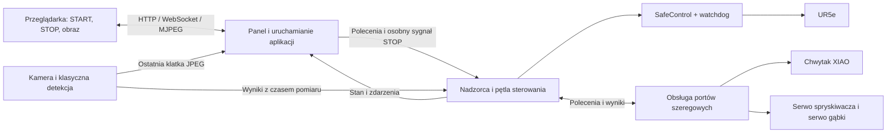
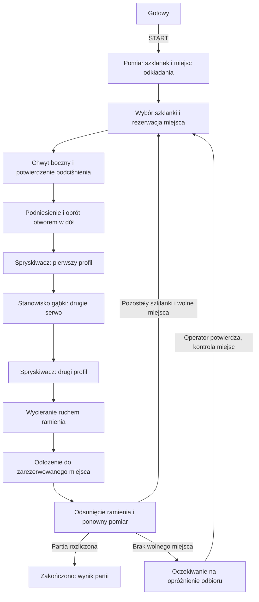

# Plan programu nadrzędnego systemu mycia szklanek

Data: 2026-09-27. Baza implementacji: lokalny `master`, commit `7c145d2`.
Dokument jest planem; nie uruchamia sprzętu i nie wprowadza kodu wykonawczego.
Przygotowano go przez odczyt `master`, bez przełączania aktywnego brancha.

## 1. Ustalony zakres i założenia pierwszej wersji

- Szklanki stoją początkowo otworem do góry, w zmiennych miejscach obszaru pobierania.
- Kamera nad stołem wykrywa je klasycznym algorytmem z `master`.
  Zmiany z `feature/table-diff-classifier` nie wchodzą do rozwiązania.
- Przyssawka chwyta bok szklanki. UR5e podnosi ją i obraca otworem w dół.
- Kolejność obróbki: spryskiwacz → gąbka → spryskiwacz → materiał wycierający.
- Spryskiwacz i gąbka mają osobne serwa na magistrali obsługiwanej przez `bus_servos.py`.
  Ramię wykonuje ruch wycierania przy nieruchomym materiale.
- Stanowiska są stałe; ich pozycje i drogi podejścia zostaną nauczone.
- START uruchamia obsługę wszystkich szklanek wykrytych na początku partii.
  Kamera aktualizuje ich pozycje przed kolejnymi chwytami.
- Panel w sieci lokalnej udostępnia sterowanie, stan cyklu i podgląd kamery.

Założenia projektowe do pierwszego uruchomienia: robot trzyma szklankę przez
cały cykl, także podczas pracy gąbki i wycierania; odkłada ją otworem w dół.
Szklanki mają jeden zmierzony profil wymiarów. Dokładane po START szklanki
wchodzą do następnej partii. Początkowo jedno dozwolone ID AprilTaga oznacza
jedno miejsce odkładania. Te wybory można później zmienić bez zmiany architektury.

## 2. Podział na operacje: moduły i jeden nadzorca

Rekomendacja: jeden uruchamiany program Python, jedna maszyna stanów procesu
i osobne moduły implementujące operacje. Przykładowe operacje to `PickGlass`,
`FlipGlass`, `VisitStation`, `Spray`, `Sponge`, `Wipe` i `PlaceGlass`.

Osobne pliki są dobrym podziałem kodu. Uruchamianie osobnego skryptu przez
`subprocess` przy każdym etapie utrudnia zachowanie wspólnego stanu chwytu,
obsługę STOP i utrzymanie połączeń. Otwarcie portu chwytaka może zresetować
mikrokontroler, a ponowne tworzenie sterowania RTDE ingeruje w skrypt robota.
Połączenia powinny istnieć przez całą pracę nadzorcy.

| Podejście | Konsekwencje w tym systemie |
| --- | --- |
| Skrypt na każdy etap cyklu | Ponowne inicjalizacje, przekazywanie stanu między uruchomieniami, trudniejsze przerwanie całego cyklu |
| Jedna duża funkcja z kolejnymi wywołaniami i `sleep()` | Łatwa pierwsza demonstracja, trudna obsługa błędów i reagowanie podczas długiej operacji |
| Nadzorca i operacje wykonywane małymi krokami | Wspólny stan urządzeń, kontrolowane przejścia i anulowanie, możliwość sprawdzania operacji oddzielnie |

Każda operacja ma warunki wejścia, metodę wykonania kolejnego krótkiego kroku,
termin zakończenia, wynik i obsługę anulowania. Wyniki rozróżniają `RUNNING`,
`SUCCEEDED`, `FAILED`, `CANCELLED`; zakończenie generatora samo w sobie nie
oznacza powodzenia. Bazą może być istniejący mechanizm `Task`, po oddzieleniu
go od pętli obrazu i dodaniu jawnych wyników.

Nadzorca przechowuje: etap, ID partii i szklanki, stan chwytu, orientację
szklanki, zarezerwowane miejsce, aktywną operację oraz przyczynę zatrzymania.
Operacje nie otwierają samodzielnie połączeń i nie wydają poleceń poza swoim
przydziałem. Narzędzie serwisowe może wywołać tę samą operację przez nadzorcę.

## 3. Architektura wykonania

Proponuję trzy stale działające procesy uruchamiane jednym poleceniem:
panel/uruchamianie aplikacji, sterowanie oraz kamera/detekcja. Rozdzielenie
kamery i panelu od sterowania pozwala ograniczyć ich wpływ na terminową
obsługę robota. To podział wykonania jednej aplikacji, ze wspólnym nadzorem
startu i zamykania.

Tylko pętla sterowania korzysta z interfejsu sterującego RTDE. Biblioteka
nie zapewnia bezpieczeństwa jego równoległych wywołań; pojedynczy właściciel
upraszcza tę odpowiedzialność. Źródło: [interfejs ur_rtde](https://gitlab.com/sdurobotics/ur_rtde/-/blob/master/include/ur_rtde/rtde_control_interface.h).

Zasady wykonania:

- Docelowo krok sterowania co około 20 ms, do potwierdzenia pomiarami na
  laptopie. Python i ten podział procesów nie gwarantują czasu rzeczywistego.
- Ruchy `moveL`/`moveJ` asynchroniczne, zawsze przez `SafeControl`.
  Kontrola zakończenia obejmuje przyjęcie polecenia, postęp, osiągniętą pozę
  i limit czasu. Przy `moveJ` trzeba również zmierzyć koszt sprawdzania FK
  w istniejącym `SafeControl`.
- Watchdog pozostaje w pętli rzeczywiście wykonującej sterowanie. Nie dodajemy
  niezależnego wątku, który podtrzymywałby go po zawieszeniu nadzorcy.
  Aktualny próg 5 Hz pozostaje; rozruch urządzeń i rozgrzanie detekcji odbywają
  się przed uzbrojeniem cyklu. Watchdog RTDE kontroluje częstotliwość aktualizacji,
  a stan operacji musi kontrolować aplikacja. Źródło:
  [UR: rtde_set_watchdog](https://www.universal-robots.com/manuals/EN/HTML/SW5_19/Content/prod-scriptmanual/G5/rtde_set_watchdog_variable_name.htm).
- Obsługa USB pracuje poza pętlą ruchu: jeden właściciel portu chwytaka oraz
  jeden właściciel wspólnej magistrali obu serw. Wyniki mają identyfikator
  polecenia, czas i jawny błąd. Transakcje mają całkowity limit czasu.
- Pętla ruchu nie wykonuje blokujących `is_holding()`, `wait_until_stopped()`,
  `Sprayer.stop()` z `join()` ani oczekiwania na ponowne połączenie USB.
- Kolejki mają ograniczony rozmiar. Obraz i telemetria zastępują starszą próbkę;
  komendy nie giną po cichu. STOP ma oddzielny priorytetowy sygnał i unieważnia
  oczekujące polecenia poprzedniej operacji, również te kierowane do serw.
- Opóźnione START i wyniki z poprzedniej sesji są odrzucane. Czasy timeoutów
  liczymy zegarem monotonicznym.
- Brak świeżych danych kamery/urządzeń lub utrata procesu panelu powoduje
  kontrolowane zatrzymanie partii. Zamknięcie samej przeglądarki nie przerywa
  rozpoczętej partii; ponowne otwarcie odtwarza jej bieżący stan.
- Jedna instancja nadzorcy, jeden worker serwera HTTP, bez automatycznego
  przeładowywania kodu przy pracy ze sprzętem. Stare demonstracje i teleoperacja
  nie mogą równolegle sterować tym samym robotem. Lokalny gamepad jest wejściem
  nadzorcy; ruch drążka anuluje automat przed przejęciem sterowania.

## 4. Przebieg partii i jednej szklanki

Z każdego aktywnego etapu STOP lub błąd prowadzi przez `STOPPING` do
`STOPPED` albo `FAULT`. Nie przechodzimy do kolejnej operacji po samym upływie
czasu, jeżeli potrzebne jest potwierdzenie urządzenia.

| Etap | Działanie i warunek powodzenia |
| --- | --- |
| Przygotowanie | Robot gotowy, znana konfiguracja TCP, poprawna kalibracja, świeży obraz, działający chwytak i oba serwa, komplet nauczonych pozycji |
| Wybór | Stabilna detekcja szklanki, wolna droga podejścia w przygotowanym obszarze, zarezerwowane wolne miejsce odkładania |
| Chwyt | Podejście boczne, włączenie podciśnienia, ograniczony docisk; przejście dopiero po potwierdzonym `GRIP OK` i świeżym stanie urządzenia |
| Podniesienie i obrót | Uniesienie całej szklanki ponad przeszkody, przejazd do strefy obrotu, kontrolowany obrót o 180° |
| Spryskiwanie 1 | Dojazd przez punkt podejścia, potwierdzona pozycja robocza, zadana liczba naciśnięć pompki, potwierdzony powrót serwa |
| Gąbka | Dojazd i ograniczony kontakt, określony profil ruchu drugiego serwa, potwierdzenie zatrzymania przed odjazdem |
| Spryskiwanie 2 | Powrót na to samo stanowisko; osobny parametr liczby naciśnięć i przerw dla drugiego przejścia |
| Wycieranie | Dojazd i kontakt z materiałem, krótka nauczona sekwencja ruchów ramienia, kontrola siły i utrzymania chwytu |
| Odłożenie | Ustawienie szklanki nad miejscem, potwierdzenie podparcia w dopuszczalnej strefie, zwolnienie przyssawki, potwierdzenie zakończenia wydmuchu i odsunięcie |
| Następna szklanka | Zapis wyniku, aktualizacja zajętości odbioru, ramię poza polem widzenia, ponowny pomiar pozostałych celów |

Pierwszy i drugi sprysk używają tej samej operacji z innymi parametrami.
Nie zakładamy, że drugie przejście jest płukaniem innym płynem: sprzęt opisany
w wymaganiach ma jeden spryskiwacz.

## 5. Geometria chwytu, obrotu i kontaktu

Na `master` detektor może mierzyć obrzeże stojącej szklanki po ustawieniu
odpowiedniej wysokości płaszczyzny. Trzeba dostroić go do otworu szklanki:
wysokość, zakres średnic i filtr obrazu. Promień ściany na wysokości przyssawki
jest osobnym wymiarem; nie należy zastępować go promieniem widocznego otworu.
Klasyczny detektor nie potwierdza orientacji, dlatego ustawienie otworem do góry
pozostaje warunkiem przygotowania obszaru wejściowego.

Po chwycie utrzymujemy transformację szklanki względem TCP, `T_tcp_glass`.
Pozycje stanowisk opisujemy względem szklanki, np. środka otworu, a docelowy
TCP wyznaczamy jako `T_base_tcp = T_base_glass · inverse(T_tcp_glass)`.
Pozwala to poprawnie uwzględnić przesunięcie szklanki po obrocie przy chwycie
bocznym. Orientacji axis-angle nie obracamy przez dodanie 180° do jednej
składowej wektora; składamy macierze obrotu i przeliczamy wynik.

Obrót odbywa się w nauczonej wolnej przestrzeni, przez sprawdzone pozycje
pośrednie. Kontrola obejmuje obrys szklanki, chwytaka, ramienia i przewodów
w całym ruchu. Obecny `SafeControl` ogranicza wysokość TCP i nie zapewnia
pełnego sprawdzania kolizji. Drogi między stanowiskami prowadzą przez
nauczone punkty wyjścia, przejazdu i podejścia, zamiast bezpośrednich skrótów.

Przy gąbce i wycieraniu zaczynamy od krótkich ruchów pozycyjnych z ograniczonym
zakresem kontaktu i monitorowaniem siły. `forceMode` jest obecnie blokowany
przez `SafeControl` i nie jest potrzebny do pierwszej wersji. Limity trzeba
ustalić na podstawie prób uchwytu i mechaniki stanowiska; istniejące progi
kontaktu przy podnoszeniu nie są automatycznie właściwe do mycia. Pomiar
podciśnienia nie wykryje każdego przesunięcia lub obrotu szkła w przyssawce,
więc powtarzalność chwytu przy obciążeniu gąbką jest warunkiem walidacji.

## 5.1. Wysokość stanowisk i niedopuszczanie do kolizji

Każde stanowisko jest przeszkodą przestrzenną we wszystkich etapach cyklu.
Zapisujemy jego obrys X/Y, dolną i górną granicę Z w układzie bazy robota,
części sztywne oraz nauczoną strefę dostępu roboczego. Jeżeli wysokość jest
mierzona od stołu, górna granica wynosi `table_z + wysokość stanowiska`.
Obrys obejmuje mocowania, dyszę i cały zakres ruchu serwa/gąbki, a nie tylko
aktualne położenie napędu. Wymiary wymagają pomiaru na rzeczywistym stanowisku.

Do kontroli drogi wliczamy chwytak i całą niesioną szklankę, także pośrednie
orientacje podczas odwracania. Pierwszy model używa konserwatywnej otoczki
wokół TCP obejmującej je we wszystkich orientacjach. Sam TCP może być powyżej
stanowiska, podczas gdy szklanka nadal uderza w jego krawędź.

Domyślny przejazd to: wycofanie z bieżącego stanowiska → podniesienie →
przejazd nad przeszkodami → podejście do następnego stanowiska. Wysokość TCP
przejazdu musi przekraczać najwyższą górną granicę stanowisk o zasięg otoczki
chwytaka/szklanki oraz ustalony margines. Gdy wymagane Z przekracza
`MAX_TCP_Z`, ruch jest odrzucany. Nie obniżamy wysokości do limitu ani nie
podnosimy limitu automatycznie. Alternatywą może być osobno nauczony i
sprawdzony przejazd bokiem, jeżeli stanowisko nie pozwala przejechać nad nim.

Sprawdzane są całe odcinki ruchu, również pionowe podniesienie i opuszczenie.
Dwa wolne punkty końcowe nie dowodzą, że droga między nimi jest wolna.
Stanowisko docelowe pozostaje przeszkodą: jego nauczony korytarz roboczy jest
dostępny tylko podczas właściwego podejścia, pracy i wycofania. Części sztywne
stanowiska oraz wszystkie inne stanowiska pozostają zabronione. Uprawnienie
do pracy przy spryskiwaczu nie pozwala przejechać przez gąbkę lub wycieraczkę.

Receptura ma osobne operacje `LEAVE_SPRAYER_1`, `LEAVE_SPONGE`,
`LEAVE_SPRAYER_2` i `LEAVE_WIPER`. Każda musi zakończyć wycofanie do wolnej
przestrzeni przed przejazdem do kolejnego stanowiska. Po zatrzymaniu w
kontakcie nie wykonujemy automatycznego skrótu do pozycji HOME.

Walidacja poprzedza wysłanie ruchu. Zmiana pozycji początkowej, geometrii
stanowiska, profilu szkła lub narzędzia unieważnia wcześniej sprawdzony plan.
Zmiana ustawienia stanowiska wymaga zatrzymania oraz ponownego sprawdzenia
jego wymiarów i dróg. Przy integracji sprzętowej trzeba również kontrolować
odchylenie rzeczywistego ruchu od zatwierdzonej drogi.

Kontrola otoczki TCP względem stanowisk jest pierwszą warstwą. Przed pracą
sprzętową trzeba dodatkowo sprawdzić wszystkie człony UR5e, przewody i
rzeczywistą trajektorię. Odcinek między pozycjami TCP nie opisuje łuku `moveJ`;
walidator odcinków nie uprawnia do takiego ruchu bez osobnej kontroli.

## 6. Nauka stanowisk, serwa i parametry

Tryb uczenia zapisuje dla każdego stanowiska pozycję podejścia, pozycję
roboczą, pozycję wycofania oraz niezbędne punkty pośrednie. Oddzielnie zapisuje
strefę obrotu i pozycję obserwacji. Najprostszy interfejs uczenia: operator
ustawia ramię lokalnie, a nadzorca zapisuje aktualną pozę z RTDE. Zapis tylko
poza automatycznym cyklem; powiązany z wersją TCP, kalibracją i profilem szkła.

| Stanowisko | Dane do nauczenia lub zmierzenia |
| --- | --- |
| Spryskiwacz | Pozycja otworu względem dyszy; kąty spoczynku/naciśnięcia; liczba cykli dla każdego sprysku |
| Gąbka | Pozycja szkła względem gąbki; kierunek, zakres lub prędkość jej ruchu; liczba powtórzeń/czas; dozwolony kontakt |
| Wycieranie | Początek i koniec każdego odcinka po materiale; orientacja szkła; liczba przejść; ograniczenia kontaktu |
| Odkładanie | Dozwolone ID tagów; poziom podparcia; odstęp od innych miejsc; orientacja szkła i droga odsunięcia przyssawki |

Mapowanie serw ma role `SPRAYER` i `SPONGE`. Obecny `ROTATOR_ID` jest punktem
wyjścia do przypisania drugiego serwa; ID i kierunek trzeba sprawdzić przy
uruchomieniu. Nie używamy tego serwa do odwracania szklanki.

Dokładny profil mechaniczny gąbki pozostaje parametrem do ustalenia na
stanowisku: ruch obrotowy ciągły albo ruch pomiędzy pozycjami. Obie wersje mają
ten sam kontrakt rozpoczęcia, wyniku i zatrzymania. Preferowany pierwszy test
wykorzystuje skończone ruchy pozycyjne, jeśli mechanika na to pozwala.
Przy ruchu ciągłym samo odmierzenie czasu na PC nie zatrzyma serwa po awarii
komputera lub USB. Taki wariant wymaga niezależnego ograniczenia czasu pracy
w urządzeniu albo sprzętowego zatrzymania napędu; watchdog UR obejmuje ramię.

Stałe programowe pozostają w Pythonie, zgodnie z konwencją repozytorium,
z jednostkami przy wartościach. Wyuczone pozycje i dane edytowane podczas
uczenia trafiają do wersjonowanego formatu JSON, zapisywanego atomowo.
Nie przepisujemy ani nie usuwamy istniejących plików kalibracji.

## 7. Wszystkie szklanki i miejsca odbioru

START tworzy partię ze stabilnych detekcji w zadanym obszarze wejściowym.
Przed każdym chwytem kamera ponownie mierzy cel, a nadzorca dopasowuje go do
pozostałych elementów partii. Nie odtwarzamy całej listy starych współrzędnych
bez pomiarów. Zniknięcie, zbyt duże przesunięcie lub niejednoznaczne dopasowanie
powoduje ponowny pomiar, a po ograniczonej liczbie prób oznaczenie celu jako
niedostępnego. Nie zamieniamy go po cichu na nową szklankę.

Obszar wejściowy jest rozłączny ze stanowiskami i obszarem odkładania.
Zakończona szklanka nie wraca do kolejki przez sam fakt, że kamera nadal ją
widzi. Blisko ustawione szklanki wymagają oceny odstępu dla chwytaka; klasyczna
detekcja nie dostarcza ogólnej mapy przeszkód ani detekcji ludzi.

Miejsce odbioru ma stan `FREE`, `RESERVED`, `OCCUPIED` albo `UNKNOWN`.
Rezerwacja następuje przed podniesieniem szkła. Lista dozwolonych tagów jest
jawna; nie wybieramy automatycznie najniższego spośród dowolnych widocznych ID.
Pierwsza wersja używa jednego miejsca na tag. Większą pojemność można później
uzyskać przez nauczoną siatkę względem znacznika.

Zajętość początkowa musi zostać potwierdzona przez operatora i sprawdzona na
dostępnym obrazie. Sam widoczny tag nie dowodzi, że cała przestrzeń nad nim jest
wolna. Po odłożeniu tag może zostać zasłonięty; jego zapamiętana pozycja nie
zmienia miejsca na wolne. Reset programu również nie zwalnia miejsc.
Przerwana rezerwacja trafia do `UNKNOWN`, do rozstrzygnięcia po kontroli.

Gdy zabraknie miejsc, robot kończy odłożenie bieżącej szklanki i czeka bez
pobierania następnej. Operator opróżnia odbiór i oznacza miejsca do ponownej
kontroli. Po rozliczeniu partii panel pokazuje liczbę ukończonych, pominiętych
i nieudanych sztuk; błąd nie jest raportowany jako pełne powodzenie.

## 8. Zatrzymanie i obsługa błędów

| Zdarzenie | Reakcja nadzorcy |
| --- | --- |
| STOP lub przejęcie gamepadem | Anulowanie operacji i oczekujących poleceń, zatrzymanie właściwego rodzaju ruchu ramienia i napędów stanowisk, zachowanie podciśnienia |
| Brak potwierdzenia chwytu przed podniesieniem | Brak podniesienia; zwolnienie i odsunięcie tylko według sprawdzonej procedury, gdy szklanka nadal stoi na podparciu |
| `GRIP LOST`, `GRIP UNKNOWN` lub brak świeżej odpowiedzi podczas przenoszenia | Zatrzymanie partii, zachowanie włączenia podciśnienia, wymagane sprawdzenie sytuacji |
| Brak odpowiedzi serwa, błąd statusu lub nieosiągnięta pozycja | Zatrzymanie etapu i ramienia; próba zatrzymania napędu; brak odpowiedzi pozostawia stan urządzenia nieznany |
| Nadmierna siła lub nieoczekiwany kontakt | Zatrzymanie; bez automatycznego odjazdu, który mógłby pogorszyć zakleszczenie |
| Brak potwierdzonego podparcia przy odkładaniu | Bez automatycznego RELEASE; osiągnięcie granicy ruchu nie jest potwierdzeniem kontaktu |
| Utrata kamery, RTDE, procesu aplikacji lub watchdog | Zatrzymanie i zatrzaśnięty błąd; powrót łączności sam nie wznawia ruchu |
| Ponowne uruchomienie po przerwanej partii | Stan do sprawdzenia, odtworzenie dziennika; bez wznowienia dawnego kroku i bez automatycznego resetu chwytaka trzymającego szkło |

STOP z panelu jest zatrzymaniem programowym. Fizyczne zatrzymanie awaryjne
pozostaje funkcją instalacji robota i napędów. Zgłoszenie STOP nie oznacza
jeszcze potwierdzenia zatrzymania: panel pokazuje osobno przyjęcie żądania
i stan urządzeń. Timeout zatrzymania pozostawia `FAULT`.

Każda operacja ma ograniczony czas i monitoruje chwyt także podczas czekania,
spryskiwania i wycierania. Ostatnie zapamiętane `GRIP OK` wymaga niezależnej
kontroli świeżości komunikacji; brak nowych komunikatów sam nie potwierdza
sprawności czujnika. Cykliczny odczyt stanu odbywa się w obsłudze portu.

Po błędzie operator rozstrzyga położenie szkła i zajętość odbioru, usuwa
przyczynę i resetuje błąd. RESET tylko przywraca gotowość po weryfikacji;
osobne START uruchamia dalszą pracę. Pierwsza wersja nie wznawia automatycznie
od połowy ruchu. Otwarcie portu XIAO i restart firmware mogą wyłączyć chwyt,
więc odtwarzanie po awarii nie może automatycznie ponownie otwierać tego portu,
jeżeli dziennik lub oględziny wskazują możliwość trzymania szkła.

## 9. Panel sieciowy

Proponowany stos: FastAPI, jeden proces serwera Uvicorn i zwykły HTML/JS.
Polecenia przez HTTP, aktualizacje stanu przez WebSocket, obraz jako MJPEG.
FastAPI obsługuje [WebSocket](https://fastapi.tiangolo.com/advanced/websockets/)
i [odpowiedzi strumieniowe](https://fastapi.tiangolo.com/advanced/custom-response/#streamingresponse);
wybór MJPEG jest propozycją prostego podglądu w sieci lokalnej.

Panel pokazuje podgląd z oznaczonymi celami i miejscami odbioru, przyciski
START i STOP, bieżącą operację, postęp partii oraz stany urządzeń i błąd
z opisem potrzebnej interwencji. Przycisk opróżnienia odbioru działa w stanie
oczekiwania; reset błędu nie uruchamia ruchu. Prosty tryb uczenia umożliwia
zapis pozycji ustawionej lokalnie. Ręczne uruchamianie operacji jest funkcją
serwisową do dodania po działającym cyklu, z tymi samymi blokadami nadzorcy.

| Interfejs | Zastosowanie |
| --- | --- |
| `GET /api/status` | Pełny stan po otwarciu lub odświeżeniu panelu |
| `POST /api/batch/start` | Utworzenie jednej partii, z ID polecenia chroniącym przed ponowieniem |
| `POST /api/stop` | Priorytetowe żądanie anulowania i zatrzymania |
| `POST /api/fault/reset` | Sprawdzenie warunków i skasowanie błędu bez ruchu |
| `POST /api/output/confirm-cleared` | Zgłoszenie opróżnienia wskazanych miejsc do ponownej kontroli |
| `POST /api/teach/capture` | Zapis aktualnej pozycji pod nazwą, tylko w trybie uczenia |
| `GET /api/commands/{id}` | Wynik przyjęcia i wykonania polecenia, także po zerwaniu HTTP |
| `WS /api/events` | Zmiany stanu, postęp i komunikaty |
| `GET /camera.mjpg` | Ostatnia klatka z kamery; bez otwierania drugiej instancji kamery |

Endpointy przekazują polecenia nadzorcy i nie wykonują ruchów bezpośrednio.
HTTP 202 oznacza przyjęcie do obsługi, a wynik nadzorcy określa akceptację
i wykonanie. Ponowne START podczas pracy nie tworzy kolejnej partii.

Podgląd początkowo około 5–10 klatek/s, pomiar sterujący w skalibrowanej
rozdzielczości; zmniejszać można sam obraz podglądu. Każda próbka ma numer
i czas. Panel wyraźnie oznacza nieaktualny obraz i utratę telemetrii.
Wolny klient otrzymuje najnowszą klatkę bez gromadzenia zaległego wideo.

Dostęp w LAN z prostą sesją operatora/tokenem, ochroną żądań zmieniających
stan i kontrolą Origin. Podgląd nie wymaga uprawnień do sterowania. Jedna
aktywna partia jest egzekwowana przez nadzorcę także przy kilku otwartych kartach.

## 10. Zmiany w repozytorium

Implementację należy rozpocząć na nowej gałęzi utworzonej z `master`.
Nie scalać kodu detekcji różnicowej. Wydzielać tylko kod potrzebny nadzorcy;
uniknąć przebudowy wszystkich demonstracji i wprowadzania ROS.

Proponowany początkowy podział w `ur5e_experiments/`:

| Plik lub katalog | Odpowiedzialność |
| --- | --- |
| `system_main.py` | Jeden punkt uruchomienia, blokada drugiej instancji, start i nadzór procesów |
| `system_controller.py` | Pętla sterowania, maszyna stanów, komendy, zatrzymanie |
| `system_operations.py` | Chwyt, obrót, przejazd, obróbka i odkładanie wykonywane małymi krokami |
| `system_geometry.py` | Profil szkła, transformacja TCP–szklanka, wyznaczanie pozycji po obrocie |
| `system_io.py` | Obsługa chwytaka i magistrali serw poza pętlą ruchu |
| `system_vision.py` | Klasyczna detekcja, pomiary partii, tagi, publikowanie obrazu |
| `system_batch.py` | Identyfikacja celów partii, rezerwacje odbioru i wyniki |
| `system_settings.py` | Stałe aplikacji i profil procesu z jednostkami |
| `system_web.py`, `web/` | API oraz statyczny panel HTML/JS |
| `tests/test_system_*.py` | Testy logiki na atrapach urządzeń i zapisanych obrazach |

Wykorzystać istniejące `safe_motion.py`, `robot_watchdog.py`, `suction.py`,
`bus_servos.py`, `find_glasses.py` i kalibracje. Nowe moduły nie łączą się ze
sprzętem przy imporcie. Wyuczone pozycje, stan odbioru i dziennik zdarzeń są
danymi aplikacji. Dziennik zawiera ID partii/operacji, czasy, wyniki i błędy;
służy do diagnozy i odtworzenia sytuacji, nie do automatycznego odtwarzania ruchów.

Konkretne fragmenty `master` wymagające adaptacji:

1. `pick_place_glasses.main()`: kamera, detekcja i sterowanie są w jednej pętli.
   Przenieść pomiar do procesu wizji; również `finder.measure()` nie może
   blokować pętli ruchu. Ten problem istnieje niezależnie od detekcji różnicowej.
2. `Task`: oddzielić ukończenie od błędu, dodać timeouty, wynik operacji
   i anulowanie dostosowane do aktywnego rodzaju ruchu.
3. `wait_for_grip()` dopuszcza `UNKNOWN`, a `connect_suction()` może zwrócić
   `NoSuction`. Tryb rzeczywisty nadzorcy wymaga działającego chwytaka i `OK`;
   atrapy mogą działać wyłącznie w jawnym trybie symulacji bez sprzętu.
4. Potwierdzanie chwytu: ujednolicić relację timeoutu hosta 6 s do 8 s
   w firmware i 10 s w sterowniku. Nie zmieniać progów podciśnienia bez pomiarów.
5. `move_to()` monitoruje tylko `LOST` i tylko w części etapów; nadzorca
   monitoruje również `UNKNOWN` i aktualność danych przez cały okres chwytu.
6. `push()` nie rozróżnia osiągnięcia granicy drogi od kontaktu. Zwracać
   powód zakończenia; przy odkładaniu brak podparcia nie może prowadzić do RELEASE.
7. `release_pending()` po timeout przestaje czekać. Nowy adapter musi osobno
   raportować potwierdzone `DONE RELEASE`, timeout i stan nieznany.
8. `Sprayer` zawiera blokujące oczekiwania i nie przekazuje nadzorcy wyniku
   pracy. Timeout `wait_until_stopped()` i błędy statusu serwa muszą wpływać
   na wynik operacji, a STOP nie może czekać w pętli ruchu na koniec skoku pompki.
9. `find_place_tag()` i `choose_glass()` obsługują jeden cel odkładania;
   zastąpić ten wybór rezerwacją miejsc i zarządzaniem partią.

## 11. Kolejność wdrożenia i kryteria odbioru

| Etap | Zakres | Warunek zakończenia |
| --- | --- | --- |
| 1. Rdzeń bez sprzętu | Maszyna stanów, operacje, komendy, fake robot/chwytak/serwa, dziennik | Pełna partia przechodzi na atrapach; błąd nie uruchamia następnego kroku; STOP działa w każdym etapie |
| 2. Kamera i panel | Klasyczna detekcja z `master`, podgląd, START/STOP do symulacji | Kilka klientów i powolny odbiorca nie blokują nadzorcy; nie ma podwójnego START; stare dane są odrzucane |
| 3. Integracja urządzeń i uczenie | Rozdzielona obsługa I/O, walidacja konfiguracji, zapis dróg i pozycji | Znane ID serw i TCP; potwierdzenia/timeouty rozróżniane; sprawdzona sekwencja uruchomienia i zatrzymania |
| 4. Pobranie, obrót i odłożenie jednej sztuki | Geometria szkła, chwyt boczny, obrót UR5e, jeden tag | Powtarzalny cykl z potwierdzeniem chwytu i podparcia; zweryfikowana cała droga obrotu |
| 5. Stanowiska osobno | Sprysk, gąbka, drugi sprysk, wycieranie | Zmierzone profile ruchu i limity kontaktu; uchwyt utrzymuje geometrię szkła; serwa raportują zakończenie |
| 6. Pełny cykl i partia | Połączenie operacji, wiele tagów, kolejne szklanki | Każdy cel obsłużony najwyżej raz, pełny odbiór wstrzymuje pobieranie, wynik partii jest rozliczony |
| 7. Próby przerwań i obciążenia | Utrata obrazu/telemetrii, STOP, restart, powolny panel | Brak samoczynnego wznowienia, zachowane rezerwacje i chwyt, czasy reakcji zmierzone na docelowym komputerze |

Testy automatyczne obejmują przejścia maszyny stanów, timeouty, anulowanie,
spóźnione odpowiedzi, rezerwacje i geometrię obrotu. Testy obrazu używają
nagrań rzeczywistych szklanek stojących otworem do góry w obszarze roboczym.
URSim służy do sprawdzania sekwencji RTDE; nie potwierdza przyczepności,
kontaktu gąbki, działania płynu ani sił wycierania.

Pierwszy odbiór sprzętowy: jedna szklanka, jedno miejsce i nauczone drogi.
Dopiero po przejściu całego cyklu rozszerzyć próbę na partię oraz kilka miejsc.
Progi siły, czasy, prędkości i odległości pozostają do zmierzenia; nie dobieramy
ich wyłącznie na podstawie kodu demonstracyjnego. Istniejące limity wysokości
i pozostałe zabezpieczenia nie są automatycznie zwiększane na potrzeby cyklu.
